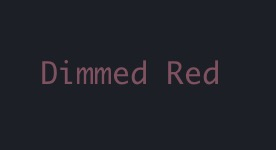

# Ink 官方文档翻译

<h1 align="center">
  <br>
  <br>
  
  <br>
  <br>
  <br>
</h1>

> 用 React 书写 CLI. 使用组件构建和测试你的 CLI 工具.

[](https://github.com/vadimdemedes/ink/actions)
[](https://npmjs.com/package/ink)

Ink 提供了与在浏览器中使用 React 一样的基于组件构建 UI 的开发体验。
Ink 使用了 [Yoga](https://github.com/facebook/yoga) 在终端中搭建 `FLexbox` 布局, 所以大部分 `CSS-like` 的参数在 Ink 中也能使用。
如果你对 React 熟悉，那你也应该了解如何使用 Ink 。

Ink 一 React 染器，意味着所 React 功能都能够支持。
请前往 [React](https://reactjs.org) 的官方网站查看使用它的文档。
只 Ink 方法会在本 Readme 中被提及。

**注意：** 这 `Ink3` 文档。 如果你在寻 `Ink2` 文档, 请查看 [这个版本](https://github.com/vadimdemedes/ink/tree/v2.7.1)。 同时，`Ink2` 到 `Ink3`的 [迁移指南](migrate.md) 请查看这里。

## 安装

```shell
$ npm install ink react
```

## 用例

```jsx
import React, { useState, useEffect } from 'react';
import { render, Text } from 'ink';

const Counter = () => {
  const [counter, setCounter] = useState(0);

  useEffect(() => {
    const timer = setInterval(() => {
      setCounter((previousCounter) => previousCounter + 1);
    }, 100);

    return () => {
      clearInterval(timer);
    };
  }, []);

  return <Text color="green">{counter} tests passed</Text>;
};

render(<Counter />);
```


你也可以在 [这里](https://ink-counter-demo.vadimdemedes.repl.run/) 实时查看。
随意尝试更改代码，并可以在 [这里](https://repl.it/@vadimdemedes/ink-counter-demo) 获得 `fork` 分支。

## 谁在使用 Ink?

- [Gatsby](https://www.gatsbyjs.org) - Gatsby is a modern web framework for blazing fast websites.
- [Parcel](https://parceljs.org) - Blazing fast, zero configuration web application bundler.
- [tap](https://node-tap.org) - A Test-Anything-Protocol library for JavaScript.
- [Yarn 2](https://yarnpkg.com) - Fast, reliable, and secure dependency management for JavaScript.
- [Terraform CDK](https://github.com/hashicorp/terraform-cdk) - CDK (Cloud Development Kit) for HashiCorp Terraform.
- [Typewriter](https://github.com/segmentio/typewriter) - Generates strongly-typed [Segment](https://segment.com) analytics clients from arbitrary JSON Schema.
- [Prisma](https://www.prisma.io) - The unified data layer for modern applications.
- [Wallace](https://www.projectwallace.com) - Pretty CSS analytics on the CLI.
- [Blitz](https://blitzjs.com) - The Fullstack React Framework.
- [New York Times](https://github.com/nytimes/kyt) - NYT uses Ink `kyt` - a toolkit that encapsulates and manages the configuration for web apps.
- [tink](https://github.com/npm/tink) - Next-generation runtime and package manager.
- [loki](https://github.com/oblador/loki) - Visual Regression Testing for Storybook.
- [Bit](https://github.com/teambit/bit) - Build, distribute and collaborate on components.
- [Remirror](https://github.com/remirror/remirror) - Your friendly, world-class editor toolkit.
- [Prime](https://github.com/birkir/prime) - Open source GraphQL CMS.
- [Splash](https://github.com/Shopify/polaris-react/tree/master/scripts/splash) - Observe the splash zone of a change across the Shopify's [Polaris](https://polaris.shopify.com) component library.
- [emoj](https://github.com/sindresorhus/emoj) - Find relevant emoji on the command-line.
- [emma](https://github.com/maticzav/emma-cli) - Terminal assistant to find and install npm packages.
- [sindresorhus](https://github.com/sindresorhus/sindresorhus) - The Sindre Sorhus CLI.
- [swiff](https://github.com/simple-integrated-marketing/swiff) - Multi-environment command line tools for time-saving web developers.
- [share](https://github.com/marionebl/share-cli) - Quickly share files from your command line.
- [Kubelive](https://github.com/ameerthehacker/kubelive) - CLI for Kubernetes to provide live data about the cluster and its resources.
- [changelog-view](https://github.com/jdeniau/changelog-view) - Tool view changelog in console.
- [gomoku-terminal](https://github.com/acrazing/gomoku-terminal) - Play online Gomoku in the terminal.
- [cfpush](https://github.com/mamachanko/cfpush) - An interactive Cloud Foundry tutorial in your terminal.
- [startd](https://github.com/mgrip/startd) - Turn your React component into a web app from the command-line.
- [wiki-cli](https://github.com/hexrcs/wiki-cli) - Search Wikipedia and read summaries directly in your terminal.
- [garson](https://github.com/goliney/garson) - Build interactive config-based command-line interfaces.

## 目录

- [快速开始](#getting-started)
- [组件](#components)
  - [`<Text>`](#text)
  - [`<Box>`](#box)
  - [`<Newline>`](#newline)
  - [`<Spacer>`](#spacer)
  - [`<Static>`](#static)
  - [`<Transform>`](#transform)
- [Hooks](#hooks)
  - [`useInput`](#useinputinputhandler-options)
  - [`useApp`](#useapp)
  - [`useStdin`](#usestdin)
  - [`useStdout`](#usestdout)
  - [`useStderr`](#usestderr)
  - [`useFocus`](#usefocusoptions)
  - [`useFocusManager`](#usefocusmanager)
- [API](#api)
- [测试](#testing)
- [使用 React 开发工具](#using-react-devtools)
- [有用的组件](#useful-components)
- [有用的 Hooks](#useful-hooks)
- [用例](#examples)

## 快速开始

使用 [create-ink-app](https://github.com/vadimdemedes/create-ink-app) 来快速搭建一个基 Ink CLI.

```
$ mkdir my-ink-cli
$ cd my-ink-cli
$ npx create-ink-app
```

<details><summary>手动设定</summary>
<p>

Ink 要使用与在浏览器中运行 React 用相同的 `Babel` 配置。

使 React 设配置设置 `Babel` ，来确保本 readme 中所有的示例都能够按照预期工作。
在 [安装 Babel](https://babeljs.io/docs/en/usage) 之后, 安装 `@babel/preset-react` 并将下述配置添加到 `babel.config.json` 中:

```
$ npm install --save-dev @babel/preset-react
```

```json
{
  "presets": [
    "@babel/preset-react",
    [
      "@babel/preset-env",
      {
        "targets": {
          "node": true
        }
      }
    ]
  ]
}
```

接着，创建文件 `source.js`, 在其中你可以使 Ink 写代码:

```jsx
import React from 'react';
import { render, Text } from 'ink';

const Demo = () => <Text>Hello World</Text>;

render(<Demo />);
```

然后，使用 Babel 编译文件:

```
$ npx babel source.js -o cli.js
```

现在你可以通过`Node.js`运行 `cli.js` ：

```
$ node cli
```

如果你不希望在开发中编译文件， 你可以使用 [import-jsx](https://github.com/vadimdemedes/import-jsx) 来 `require()` 一个 JSX 文件，并对其进行即时编译。

</p>
</details>

Ink 使用 [Yoga](https://github.com/facebook/yoga) - 一个 FLexbox 布局引擎，让你可以使用在浏览器中构建应用程序时所使用的 CSS 样式工具，为 CLI 构建出色的用户界面。
需要记住的是，每一个元素都是一个 FLexbox 容器。
你可以把它们当作浏览器中拥有样式 `display: flex` 的 `<div>` 。
关于如何 Ink 使用 FLexbox 布局，可以参考内置组件 [`<Box>`](#box) 。
请注意 ⚠️，所有文本都必须使用组件 [`<Text>`](#text) 包装。

## 组件

### `<Text>`

该组件用于显示文本，并可以更改其样式，以使其变为粗体、斜体或具有下划线、删除线。

```jsx
import { render, Text } from 'ink';

const Example = () => (
  <>
    <Text color="green">I am green</Text>
    <Text color="black" backgroundColor="white">
      I am black on white
    </Text>
    <Text color="#ffffff">I am white</Text>
    <Text bold>I am bold</Text>
    <Text italic>I am italic</Text>
    <Text underline>I am underline</Text>
    <Text strikethrough>I am strikethrough</Text>
    <Text inverse>I am inversed</Text>
  </>
);

render(<Example />);
```

**注意：** `<Text>` 仅允许包含文本节点和其中嵌套的 `<Text>` 组件。例如，你不能在 `<Text>` 中使用 `<Box>` 组件。

#### color

Type: `string`

改变文本的颜色。
Ink 使用 [chalk](https://github.com/chalk/chalk) , 所以支持其所有功能。

```jsx
<Text color="green">Green</Text>
<Text color="#005cc5">Blue</Text>
<Text color="rgb(232, 131, 136)">Red</Text>
```


#### backgroundColor

Type: `string`

与上面的 `color` 相同，但用于背景色。

```jsx
<Text backgroundColor="green" color="white">Green</Text>
<Text backgroundColor="#005cc5" color="white">Blue</Text>
<Text backgroundColor="rgb(232, 131, 136)" color="white">Red</Text>
```


#### dimColor

Type: `boolean`\
Default: `false`

调暗颜色（减少发光量）。

```jsx
<Text color="red" dimColor>
  Dimmed Red
</Text>
```



#### bold

Type: `boolean`\
Default: `false`

将文字改为粗体。

#### italic

Type: `boolean`\
Default: `false`

将文字改为斜体。

#### underline

Type: `boolean`\
Default: `false`

为文字增加下划线。

#### strikethrough

Type: `boolean`\
Default: `false`

为文字增加删除线。

#### inverse

Type: `boolean`\
Default: `false`

反转背景色和前景色。

```jsx
<Text inverse color="yellow">
  Inversed Yellow
</Text>
```


#### wrap

Type: `string`\
Allowed values: `wrap` `truncate` `truncate-start` `truncate-middle` `truncate-end`\
Default: `wrap`

该属性决定当 Text 的宽度大于容器的宽度时，使用包裹或是截断处理文本内容。
如果设置的是`wrap`（同时也是默认值）， Ink 将换行并将文本拆分成多行。
如果设置的是 `truncate-*` ， Ink 将改为截断文本，只显示部分内容，设置中被截断的部分将被截断。

```jsx
<Box width={7}>
  <Text>Hello World</Text>
</Box>
//=> 'Hello\nWorld'

// `truncate` is an alias to `truncate-end`
<Box width={7}>
  <Text wrap="truncate">Hello World</Text>
</Box>
//=> 'Hello…'

<Box width={7}>
  <Text wrap="truncate-middle">Hello World</Text>
</Box>
//=> 'He…ld'

<Box width={7}>
  <Text wrap="truncate-start">Hello World</Text>
</Box>
//=> '…World'
```

### `<Box>`

`<Box>` 构建布局的重要 Ink 组件。
它于浏览器中的 `<div style="display: flex">` 是类似的。

```jsx
import { render, Box, Text } from 'ink';

const Example = () => {
  <Box margin={2}>
    <Text>This is a box with margin</Text>
  </Box>;
};

render(<Example />);
```

#### 尺寸

##### width

Type: `number` `string`

元素的宽度（以单个字符宽度为单位）。
你也可以将其设置为百分比，这将根据父元素的宽度来计算宽度。

```jsx
<Box width={4}>
  <Text>X</Text>
</Box>
//=> 'X   '
```

```jsx
<Box width={10}>
  <Box width="50%">
    <Text>X</Text>
  </Box>
  <Text>Y</Text>
</Box>
//=> 'X    Y'
```

##### height

Type: `number` `string`

元素的高度（以行数为单位）。
你也可以将其设置为百分比，这将根据父元素的高度来计算高度。

```jsx
<Box height={4}>
  <Text>X</Text>
</Box>
//=> 'X\n\n\n'
```

```jsx
<Box height={6} flexDirection="column">
  <Box height="50%">
    <Text>X</Text>
  </Box>
  <Text>Y</Text>
</Box>
//=> 'X\n\n\nY\n\n'
```

##### minWidth

Type: `number`

设置元素的最小宽度。
尚不支持百分比，详情请见： https://github.com/facebook/yoga/issues/872。

##### minHeight

Type: `number`

设置元素的最小高度。
尚不支持百分比，详情请见： https://github.com/facebook/yoga/issues/872。

#### Padding

##### paddingTop

Type: `number`\
Default: `0`

Top padding.

##### paddingBottom

Type: `number`\
Default: `0`

Bottom padding.

##### paddingLeft

Type: `number`\
Default: `0`

Left padding.

##### paddingRight

Type: `number`\
Default: `0`

Right padding.

##### paddingX

Type: `number`\
Default: `0`

水平 padding. 等同于同时设置 `paddingLeft` 和 `paddingRight`.

##### paddingY

Type: `number`\
Default: `0`

垂直 padding. 等同于同时设置 `paddingTop` 和 `paddingBottom`.

##### padding

Type: `number`\
Default: `0`

所有边的 padding，等同于同时设置 `paddingTop`, `paddingBottom`, `paddingLeft` 和 `paddingRight`.

```jsx
<Box paddingTop={2}>Top</Box>
<Box paddingBottom={2}>Bottom</Box>
<Box paddingLeft={2}>Left</Box>
<Box paddingRight={2}>Right</Box>
<Box paddingX={2}>Left and right</Box>
<Box paddingY={2}>Top and bottom</Box>
<Box padding={2}>Top, bottom, left and right</Box>
```

#### Margin

##### marginTop

Type: `number`\
Default: `0`

Top margin.

##### marginBottom

Type: `number`\
Default: `0`

Bottom margin.

##### marginLeft

Type: `number`\
Default: `0`

Left margin.

##### marginRight

Type: `number`\
Default: `0`

Right margin.

##### marginX

Type: `number`\
Default: `0`

水平 margin. 等同于同时设置 `marginLeft` and `marginRight`.

##### marginY

Type: `number`\
Default: `0`

垂直 margin. 等同于同时设置 `marginTop` and `marginBottom`.

##### margin

Type: `number`\
Default: `0`

所有边的 margin，等同于同时设置 `marginTop`, `marginBottom`, `marginLeft` 和 `marginRight`.

```jsx
<Box marginTop={2}>Top</Box>
<Box marginBottom={2}>Bottom</Box>
<Box marginLeft={2}>Left</Box>
<Box marginRight={2}>Right</Box>
<Box marginX={2}>Left and right</Box>
<Box marginY={2}>Top and bottom</Box>
<Box margin={2}>Top, bottom, left and right</Box>
```

#### Flex

##### flexGrow

Type: `number`\
Default: `0`

See [flex-grow](https://css-tricks.com/almanac/properties/f/flex-grow/).

```jsx
<Box>
  <Text>Label:</Text>
  <Box flexGrow={1}>
    <Text>Fills all remaining space</Text>
  </Box>
</Box>
```

##### flexShrink

Type: `number`\
Default: `1`

见 [flex-shrink](https://css-tricks.com/almanac/properties/f/flex-shrink/).

```jsx
<Box width={20}>
  <Box flexShrink={2} width={10}>
    <Text>Will be 1/4</Text>
  </Box>
  <Box width={10}>
    <Text>Will be 3/4</Text>
  </Box>
</Box>
```

##### flexBasis

Type: `number` `string`

见 [flex-basis](https://css-tricks.com/almanac/properties/f/flex-basis/).

```jsx
<Box width={6}>
  <Box flexBasis={3}>
    <Text>X</Text>
  </Box>
  <Text>Y</Text>
</Box>
//=> 'X  Y'
```

```jsx
<Box width={6}>
  <Box flexBasis="50%">
    <Text>X</Text>
  </Box>
  <Text>Y</Text>
</Box>
//=> 'X  Y'
```

##### flexDirection

Type: `string`\
Allowed values: `row` `row-reverse` `column` `column-reverse`

见 [flex-direction](https://css-tricks.com/almanac/properties/f/flex-direction/).

```jsx
<Box>
  <Box marginRight={1}>
    <Text>X</Text>
  </Box>
  <Text>Y</Text>
</Box>
// X Y

<Box flexDirection="row-reverse">
  <Text>X</Text>
  <Box marginRight={1}>
    <Text>Y</Text>
  </Box>
</Box>
// Y X

<Box flexDirection="column">
  <Text>X</Text>
  <Text>Y</Text>
</Box>
// X
// Y

<Box flexDirection="column-reverse">
  <Text>X</Text>
  <Text>Y</Text>
</Box>
// Y
// X
```

##### alignItems

Type: `string`\
Allowed values: `flex-start` `center` `flex-end`

见 [align-items](https://css-tricks.com/almanac/properties/a/align-items/).

```jsx
<Box alignItems="flex-start">
  <Box marginRight={1}>
    <Text>X</Text>
  </Box>
  <Text>
    A
    <Newline/>
    B
    <Newline/>
    C
  </Text>
</Box>
// X A
//   B
//   C

<Box alignItems="center">
  <Box marginRight={1}>
    <Text>X</Text>
  </Box>
  <Text>
    A
    <Newline/>
    B
    <Newline/>
    C
  </Text>
</Box>
//   A
// X B
//   C

<Box alignItems="flex-end">
  <Box marginRight={1}>
    <Text>X</Text>
  </Box>
  <Text>
    A
    <Newline/>
    B
    <Newline/>
    C
  </Text>
</Box>
//   A
//   B
// X C
```

##### alignSelf

Type: `string`\
Default: `auto`\
Allowed vales: `auto` `flex-start` `center` `flex-end`

见 [align-self](https://css-tricks.com/almanac/properties/a/align-self/).

```jsx
<Box height={3}>
  <Box alignSelf="flex-start">
    <Text>X</Text>
  </Box>
</Box>
// X
//
//

<Box height={3}>
  <Box alignSelf="center">
    <Text>X</Text>
  </Box>
</Box>
//
// X
//

<Box height={3}>
  <Box alignSelf="flex-end">
    <Text>X</Text>
  </Box>
</Box>
//
//
// X
```

##### justifyContent

Type: `string`\
Allowed values: `flex-start` `center` `flex-end` `space-between` `space-around`

见 [justify-content](https://css-tricks.com/almanac/properties/j/justify-content/).

```jsx
<Box justifyContent="flex-start">
  <Text>X</Text>
</Box>
// [X      ]

<Box justifyContent="center">
  <Text>X</Text>
</Box>
// [   X   ]

<Box justifyContent="flex-end">
  <Text>X</Text>
</Box>
// [      X]

<Box justifyContent="space-between">
  <Text>X</Text>
  <Text>Y</Text>
</Box>
// [X      Y]

<Box justifyContent="space-around">
  <Text>X</Text>
  <Text>Y</Text>
</Box>
// [  X   Y  ]
```

#### Visibility

##### display

Type: `string`\
Allowed values: `flex` `none`\
Default: `flex`

该值设置为`none`时不显示元素

#### Borders

##### borderStyle

Type: `string`\
Allowed values: `single` `double` `round` `bold` `singleDouble` `doubleSingle` `classic`

添加特定样式的边框
如果 `borderStyle` 被设置为 `undefined` （默认值），则无边框。
Ink 从 [`cli-boxes`](https://github.com/sindresorhus/cli-boxes) 模块中获取边框样式。

```jsx
<Box flexDirection="column">
  <Box>
    <Box borderStyle="single" marginRight={2}>
      <Text>single</Text>
    </Box>

    <Box borderStyle="double" marginRight={2}>
      <Text>double</Text>
    </Box>

    <Box borderStyle="round" marginRight={2}>
      <Text>round</Text>
    </Box>

    <Box borderStyle="bold">
      <Text>bold</Text>
    </Box>
  </Box>

  <Box marginTop={1}>
    <Box borderStyle="singleDouble" marginRight={2}>
      <Text>singleDouble</Text>
    </Box>

    <Box borderStyle="doubleSingle" marginRight={2}>
      <Text>doubleSingle</Text>
    </Box>

    <Box borderStyle="classic">
      <Text>classic</Text>
    </Box>
  </Box>
</Box>
```


See example in [examples/borders](examples/borders/borders.js).

##### borderColor

Type: `string`

改变边框的颜色
接受与`<Text>`中相同的 [`颜色`](#color) 参数。

```jsx
<Box borderStyle="round" borderColor="green">
  <Text>Green Rounded Box</Text>
</Box>
```


### `<Newline>`

添加一个或多个 (`\n`) 字符。
必须在 `<Text>` 中使用。

#### count

Type: `number`\
Default: `1`

添加的空白行的数量。

```jsx
import { render, Text, Newline } from 'ink';

const Example = () => (
  <Text>
    <Text color="green">Hello</Text>
    <Newline />
    <Text color="red">World</Text>
  </Text>
);

render(<Example />);
```

Output:

```shell
Hello
World
```

### `<Spacer>`

一个可延伸的空白元素，可以自动填充包含其的容器。
作为填充元素之间所有可用空间的元素很有用。

例如，在一个采用了默认`flex-direction`(`row`)的`<Box>`中使用`<Spacer>`会将"Left"放在容器左侧，"Right"推到容器右侧。

```jsx
import { render, Box, Text, Spacer } from 'ink';

const Example = () => (
  <Box>
    <Text>Left</Text>
    <Spacer />
    <Text>Right</Text>
  </Box>
);

render(<Example />);
```

在一个采用了`flex-direction: column`的`<Box>`中使用`<Spacer>`会将"Top"放置在容器顶部，"Bottom"推到容器底部。请注意，容器必须足够高才能够生效。

```jsx
import { render, Box, Text, Spacer } from 'ink';

const Example = () => (
  <Box flexDirection="column" height={10}>
    <Text>Top</Text>
    <Spacer />
    <Text>Bottom</Text>
  </Box>
);

render(<Example />);
```

### `<Static>`

`<Static>` 会将其包裹的元素永久性地输出在其他元素上方。
在需要显示活动信息（如完成的任务或日志）时很有用。这些活动在呈现后不会被改变（正如其名字"Static"）。

当你无法了解或者控制需要呈现的项目数量时，最好使用`<Static>`来包裹此类用例。

例如， [Tap](https://github.com/tapjs/node-tap) 使用 `<Static>` 来显示已完成测试的列表。
[Gatsby](https://github.com/gatsbyjs/gatsby) 用它来显示已经生成页面的列表，同时仍显示实时进度栏。

```jsx
import React, { useState, useEffect } from 'react';
import { render, Static, Box, Text } from 'ink';

const Example = () => {
  const [tests, setTests] = useState([]);

  useEffect(() => {
    let completedTests = 0;
    let timer;

    const run = () => {
      // Fake 10 completed tests
      if (completedTests++ < 10) {
        setTests((previousTests) => [
          ...previousTests,
          {
            id: previousTests.length,
            title: `Test #${previousTests.length + 1}`,
          },
        ]);

        setTimeout(run, 100);
      }
    };

    run();

    return () => {
      clearTimeout(timer);
    };
  }, []);

  return (
    <>
      {/* This part will be rendered once to the terminal */}
      <Static items={tests}>
        {(test) => (
          <Box key={test.id}>
            <Text color="green">✔ {test.title}</Text>
          </Box>
        )}
      </Static>

      {/* This part keeps updating as state changes */}
      <Box marginTop={1}>
        <Text dimColor>Completed tests: {tests.length}</Text>
      </Box>
    </>
  );
};

render(<Example />);
```

**注意：** `<Static>` 只会渲染在 `items` 选项中传入的新项目而忽略先前已经渲染的项目。
这意味着，当你将新项目添加到项目数组时，对先前项目所做的更改不会触发重新渲染。

See [examples/static](examples/static/static.js) for an example usage of `<Static>` component.

#### items

Type: `Array`

任意类型的数据组成的数组，这些数据将作为参数传入生成子组件的函数中。

#### style

Type: `object`

应用于装载子元素的容器的样式。
查看 [`<Box>`](#box) 了解支持的属性。

```jsx
<Static items={...} style={{padding: 1}}>
  {...}
</Static>
```

#### children(item, index)

Type: `Function`

调用该函数来渲染 `item` 数组中的数据。
第一个参数是 `item` 本身，第二个参数是 `item` 在数组中的索引值。

注意： `key` 必须分配给根组件。

```jsx
<Static items={['a', 'b', 'c']}>
  {(item, index) => {
    // This function is called for every item in ['a', 'b', 'c']
    // `item` is 'a', 'b', 'c'
    // `index` is 0, 1, 2
    return (
      <Box key={index}>
        <Text>Item: {item}</Text>
      </Box>
    );
  }}
</Static>
```

### `<Transform>`

在将 React 组件写入输出之前，先对其进行字符串转换。
例如，你可能想为文本添加 [渐变效果](https://github.com/sindresorhus/ink-gradient), [添加链接](https://github.com/sindresorhus/ink-link) 或者 [创建一些文本效果](https://github.com/sindresorhus/ink-big-text).
这些用例不能接受 `ReactNode` 作为输入，只能够接受纯文本。
这就是 `<Transform>` 组件的作用， 它为你提供其子组件的输出字符串，并允许你使用任何方式进行转换。

**注意：** `<Transform>` 只能使用 `<Text>` 作为子组件，且不应该更改输出的尺寸，否则将会导致布局错误。

```jsx
import { render, Transform } from 'ink';

const Example = () => (
  <Transform transform={(output) => output.toUpperCase()}>
    <Text>Hello World</Text>
  </Transform>
);

render(<Example />);
```

由于 `transform` 函数将所有字符转换为大写，因此呈现给终端的最终输出将是"HELLO WORLD"，而不是"Hello World"。

#### transform(children)

Type: `Function`

改变子组件输出的函数。
它接受子组件的输出作为参数，返回转换后的输出。

##### children

Type: `string`

输出的子组件。

## Hooks

### useInput(inputHandler, options?)

这个 Hook 用于处理用户输入。
相较于使用 `useStdin` 和监听数据事件，这是一种更方便的选择。
当用户有任何的输入的时候，将每个字符作为参数传入 `useInput` 的回调函数。
但是，如果用户粘贴包含多个字符的文本，则回调将仅调用一次，并将整个字符串作为参数传入。
你可以在 [examples/use-input](examples/use-input/use-input.js) 找到 `useInput` 的完整实例。

```jsx
import {useInput} from 'ink';

const UserInput = () => {
  useInput((input, key) => {
    if (input === 'q') {
      // Exit program
    }

    if (key.leftArrow) {
      // Left arrow key pressed
    }
  });

  return …
};
```

#### inputHandler(input, key)

Type: `Function`

这一回调函数使你通过 `useInput` 获得两个参数

##### input

Type: `string`

程序接收到的输入值。

##### key

Type: `object`

关于用户按下的按键的信息。

###### key.leftArrow

###### key.rightArrow

###### key.upArrow

###### key.downArrow

Type: `boolean`\
Default: `false`

如果方向键被按下，则相应方向的值将被设置为 `true`.
比如，如果用户按下左方向键，`key.leftArrow = true`。

###### key.return

Type: `boolean`\
Default: `false`

`Return` 或 `Enter` 键被按下。

###### key.escape

Type: `boolean`\
Default: `false`

`Esc` 键被按下。

###### key.ctrl

Type: `boolean`\
Default: `false`

`Ctrl` 键被按下。

###### key.shift

Type: `boolean`\
Default: `false`

`Shift` 键被按下。

###### key.tab

Type: `boolean`\
Default: `false`

`Tab` 键被按下。

###### key.backspace

Type: `boolean`\
Default: `false`

`Backspace` 键被按下。

###### key.delete

Type: `boolean`\
Default: `false`

`Delete` 键被按下。

###### key.pageDown

###### key.pageUp

Type: `boolean`\
Default: `false`

如果翻页键被按下，则对应的值被设置为 `true`.
比如说，用户如果按下 `PageDown` 键, `key.pageDown = true`.

###### key.meta

Type: `boolean`\
Default: `false`

[Meta key](https://en.wikipedia.org/wiki/Meta_key) 被按下

#### options

Type: `object`

##### isActive

Type: `boolean`\
Default: `true`

启用或禁用捕获用户输入。
当同时存在多个 `useInput` hook 时，可以通过这一设置避免重复处理同一输入。

### useApp()

`useApp` 暴露了显式退出（或解除挂载）应用的方法。

#### exit(error?)

Type: `Function`

退出（或解除挂载）整个 Ink 应用。

##### error

Type: `Error`

可选错误。如果通过， [`waitUntilExit`](waituntilexit) 会拒绝该错误。

```js
import {useApp} from 'ink';

const Example = () => {
  const {exit} = useApp();

  // Exit the app after 5 seconds
  useEffect(() => {
    setTimeout(() => {
      exit();
    }, 5000);
  }, []);

  return …
};
```

### useStdin()

`useStdin` 是用于暴露标准输入流的 hook。

#### stdin

Type: `stream.Readable`\
Default: `process.stdin`

标准输入流通过 `option.stdin` 或 `process.stdin` （默认情况下）传递给 `render()` 函数。
如果你的 app 需要处理用户输入，这是一个很有用的 hook。

```js
import {useStdin} from 'ink';

const Example = () => {
  const {stdin} = useStdin();

  return …
};
```

#### isRawModeSupported

Type: `boolean`

一个布尔值，确定当前的 `stdin` 是否能够支持 `setRawMode` 。
使用 `setRawMode` 的组件可能会希望使用 `isRawModeSupported` 来在不支持 raw 模式的环境中进行降级处理。

```jsx
import { useStdin } from 'ink';

const Example = () => {
  const { isRawModeSupported } = useStdin();

  return isRawModeSupported ? <MyInputComponent /> : <MyComponentThatDoesntUseInput />;
};
```

#### setRawMode(isRawModeEnabled)

Type: `function`

##### isRawModeEnabled

Type: `boolean`

参考 [`setRawMode`](https://nodejs.org/api/tty.html#tty_readstream_setrawmode_mode).
Ink 暴露这个方法用于处理 <kbd>Ctrl</kbd>+<kbd>C</kbd>，这也是为什么你应该使用 Ink 的 `setRawMode` 而不是 `process.stdin.setRawMode`。

**警告：** 该函数将被舍弃除非当前的 `stdin` 支持 `setRawMode` 。使用 [`isRawModeSupported`](#israwmodesupported) 来检测 `setRawMode` 的支持情况。

```js
import {useStdin} from 'ink';

const Example = () => {
  const {setRawMode} = useStdin();

  useEffect(() => {
    setRawMode(true);

    return () => {
      setRawMode(false);
    };
  });

  return …
};
```

### useStdout()

`useStdout` 是用来暴露标准输入流的 hook ， Ink 在标准输出流中渲染你的 app 。

#### stdout

Type: `stream.Writable`\
Default: `process.stdout`

```js
import {useStdout} from 'ink';

const Example = () => {
  const {stdout} = useStdout;

  return …
};
```

#### write(data)

将任意字符写入标准输出流，同时保留 Ink 的输出。
当你要在 Ink 的渲染之外显示一些外部信息且确保两者之间不存在冲突时，你将使用到这个方法。
它于 `<Static>` 类似，但是它不能接受组件，而仅适用于字符串。

##### data

Type: `string`

要写到标准输出流的数据。

```js
import {useStdout} from 'ink';

const Example = () => {
  const {write} = useStdout();

  useEffect(() => {
    // Write a single message to stdout, above Ink's output
    write('Hello from Ink to stdout\n');
  }, []);

  return …
};
```

在 [examples/use-stdout](examples/use-stdout/use-stdout.js) 查看额外的用例。

### useStderr()

`useStderr` 是暴露标准错误流的 hook 。

#### stderr

Type: `stream.Writable`\
Default: `process.stderr`

标准错误流。

```js
import {useStderr} from 'ink';

const Example = () => {
  const {stderr} = useStderr();

  return …
};
```

#### write(data)

将任何字符串写入标准错误流，同时保留 Ink 本身的输出。
当你要在 Ink 的渲染之外显示一些外部信息且确保两者之间不存在冲突时，你将使用到这个方法。
它于 `<Static>` 类似，但是它不能接受组件，而仅适用于字符串。

##### data

Type: `string`

要写入标准错误流的数据。

```js
import {useStderr} from 'ink';

const Example = () => {
  const {write} = useStderr();

  useEffect(() => {
    // Write a single message to stderr, above Ink's output
    write('Hello from Ink to stderr\n');
  }, []);

  return …
};
```

### useFocus(options?)

使用 `useFocus` hook 的组件将成为可聚焦的组件。当用户按下 <kbd>Tab</kbd> 键时，Ink 会将焦点切换到该组件。
如果有多个执行 `useFocus` 挂钩的组件，将按照呈现这些组件的顺序将焦点给予它们。
该 hook 返回一个具有 `isFocused` 属性（布尔值）的对象，该对象确定此组件是否处于焦点状态。

#### 选项

##### autoFocus

Type: `boolean`\
Default: `false`

若当前没有活动（被聚焦）的组件，则自动聚焦该组件。

##### isActive

Type: `boolean`\
Default: `true`

是否启用此组件的可聚焦状态，同时保持其在可聚焦组件列表中的位置。
这一属性对于临时禁用组件的可聚焦状态很有用。

```jsx
import { render, useFocus, Text } from 'ink';

const Example = () => {
  const { isFocused } = useFocus();

  return <Text>{isFocused ? 'I am focused' : 'I am not focused'}</Text>;
};

render(<Example />);
```

在 [examples/use-focus](examples/use-focus/use-focus.js) 查看更多示例。

### useFocusManager()

这个 hook 暴露四个方法，用于启用或禁用所有组件的可聚焦状态，以及手动将焦点切换到上一个组件或下一个组件。

#### enableFocus()

开启所有组件的聚焦状态。

**注意：** 除非你已禁用了组件的可聚焦状态，否则无需手动调用此方法。默认情况下所有组件都是可聚焦的。

```js
import {useFocusManager} from 'ink';

const Example = () => {
  const {enableFocus} = useFocusManager();

  useEffect(() => {
    enableFocus();
  }, []);

  return …
};
```

#### disableFocus()

禁用所有组件的可聚焦状态。
如果有已经聚焦的组件，那么调用该方法是那些组件将失去聚焦状态。

```js
import {useFocusManager} from 'ink';

const Example = () => {
  const {disableFocus} = useFocusManager();

  useEffect(() => {
    disableFocus();
  }, []);

  return …
};
```

#### focusNext()

将焦点切换到下一个可聚焦的组件。
如果当前没有可聚焦的组件，则将焦点放在第一个可聚焦的组件上。
如果当前焦点所在组件是可聚焦组件列表中的最后一个组件，则将焦点切换到第一个组件。

**注意：** 当按下 <kbd>Tab</kbd> 时，Ink 会调用该方法。

```js
import {useFocusManager} from 'ink';

const Example = () => {
  const {focusNext} = useFocusManager();

  useEffect(() => {
    focusNext();
  }, []);

  return …
};
```

#### focusPrevious()

将焦点切换到上一个可聚焦的组件。
如果当前没有可聚焦的组件，则将焦点放在第一个可聚焦的组件上。
如果当前焦点所在组件是可聚焦组件列表的第一个组件，则将焦点切换到列表的最后一个组件。

**注意：** 当按下 <kbd>Shift</kbd>+<kbd>Tab</kbd> 时，Ink 会调用该方法。

```js
import {useFocusManager} from 'ink';

const Example = () => {
  const {focusPrevious} = useFocusManager();

  useEffect(() => {
    focusPrevious();
  }, []);

  return …
};
```

## API

#### render(tree, options?)

Returns: [`Instance`](#instance)

挂载组件并渲染输出。

##### tree

Type: `ReactElement`

##### options

Type: `object`

###### stdout

Type: `stream.Writable`\
Default: `process.stdout`

用于渲染 app 的输出流。

###### stdin

Type: `stream.Readable`\
Default: `process.stdin`

App 将要监听的输入流。

###### exitOnCtrlC

Type: `boolean`\
Default: `true`

配置 Ink 是否应监听 <kbd>Ctrl</kbd> + <kbd>C</kbd> 来退出应用程序。
如果 `process.stdin` 是处在 [原始模式](https://nodejs.org/api/tty.html#tty_readstream_setrawmode_mode) 下，则需要设置它；因为默认情况下会忽略 <kbd>Ctrl</kbd> + <kbd>C</kbd> ，并期望进程手动处理它。

###### patchConsole

Type: `boolean`\
Default: `true`

拼接控制台的方法，以确保控制台输出不会和 Ink 输出混合。
当任何 `console.*` 方法被调用时(比如 `console.log()`)，Ink 会截获它们的输出，清除主输出流，渲染 console 方法的输出内容，然后重渲染主输出流。
这样二者都是可见且彼此不会重叠的。

此功能基于 [patch-console](https://github.com/vadimdemedes/patch-console) 实现， 所以如果你需要禁用 Ink 的默认输出拦截功能，而进行自定义，可以使用它实现。

###### debug

Type: `boolean`\
Default: `false`

如果设置为 `true` ，则每次更新都将以单独的输出呈现，而非替换先前的输出。

#### Instance

这是 `render()` 函数返回的对象。

##### rerender(tree)

用新的根节点替换上一个节点，或更新当前根节点的一些属性。

###### tree

Type: `ReactElement`

```jsx
// Update props of the root node
const { rerender } = render(<Counter count={1} />);
rerender(<Counter count={2} />);

// Replace root node
const { rerender } = render(<OldCounter />);
rerender(<NewCounter />);
```

##### unmount()

手动卸载整个 Ink 应用。

```jsx
const { unmount } = render(<MyApp />);
unmount();
```

##### waitUntilExit()

返回一个 `promise` ，其在应用卸载(unmounted)时 `resolve` 。

```jsx
const { unmount, waitUntilExit } = render(<MyApp />);

setTimeout(unmount, 1000);

await waitUntilExit(); // resolves after `unmount()` is called
```

##### clear()

清空输出流。

```jsx
const { clear } = render(<MyApp />);
clear();
```

#### measureElement(ref)

测量特定 `<Box>` 元素的尺寸。
其返回一个具有 `width` 和 `height` 属性的对象。
当组件需要知道其拥有的可用空间量时，可以使用此方法获得。
当你需要根据其暖色的长度改变布局时，可以使用该方法。

**注意：** `measureElement()` 只有在初始渲染结束后才能够计算布局返回正确的结果。在那之前， `width` 和 `height` 被设置为 0。建议在 `useEffect` 中调用 `measureElement()` ，确保该方法在组件渲染完成后才会触发。

##### ref

Type: `MutableRef`

对使用 `ref` 属性的 `<Box>` 元素的引用。
查看 [Refs](https://reactjs.org/docs/refs-and-the-dom.html) 来获得更多信息。

```jsx
import { render, measureElement, Box, Text } from 'ink';

const Example = () => {
  const ref = useRef();

  useEffect(() => {
    const { width, height } = measureElement(ref.current);
    // width = 100, height = 1
  }, []);

  return (
    <Box width={100}>
      <Box ref={ref}>
        <Text>This box will stretch to 100 width</Text>
      </Box>
    </Box>
  );
};

render(<Example />);
```

## Testing

Ink 组件使用 [ink-testing-library](https://github.com/vadimdemedes/ink-testing-library) 既可以方便地进行测试。
这是一个对组件进行测试的简单示例。

```jsx
import React from 'react';
import { Text } from 'ink';
import { render } from 'ink-testing-library';

const Test = () => <Text>Hello World</Text>;
const { lastFrame } = render(<Test />);

lastFrame() === 'Hello World'; //=> true
```

查看 [ink-testing-library](https://github.com/vadimdemedes/ink-testing-library) 以获得更多例子和完整的文档。

## 使用 React 开发工具


Ink 为 [React Devtools](https://github.com/facebook/react/tree/master/packages/react-devtools) 提供了开箱即用的支持。
要在基于 Ink 的 CLI 中与 React Devtools 集成，请使用环境变量 `DEV=true` ：

```
$ DEV=true my-cli
```

然后，打开 React Devtools。

```
$ npx react-devtools
```

当其启动后，你应该能看到 CLI 的组件树。
你甚至能够检查和更改组件的属性，并在 CLI 中立即查看结果而无需重启应用。

**注意：** 调试完成后，你必须通过 <kbd>Ctrl</kbd> + <kbd>C</kbd> 手动退出 CLI。

## 有用的组件

- [ink-text-input](https://github.com/vadimdemedes/ink-text-input) - 文本输入 
- [ink-spinner](https://github.com/vadimdemedes/ink-spinner) - 加载中 
- [ink-select-input](https://github.com/vadimdemedes/ink-select-input) - 选择输入框 
- [ink-link](https://github.com/sindresorhus/ink-link) - 链接 
- [ink-gradient](https://github.com/sindresorhus/ink-gradient) - 彩色梯形组件 
- [ink-big-text](https://github.com/sindresorhus/ink-big-text) - 大文本 
- [ink-image](https://github.com/kevva/ink-image) - 在终端中显示图片 
- [ink-tab](https://github.com/jdeniau/ink-tab) - Tab 组件. 
- [ink-color-pipe](https://github.com/LitoMore/ink-color-pipe) - 创建带有简单样式的彩色文字 
- [ink-multi-select](https://github.com/karaggeorge/ink-multi-select) - 从列表中选择一个或多个选项 
- [ink-divider](https://github.com/JureSotosek/ink-divider) - 分割组件 
- [ink-progress-bar](https://github.com/brigand/ink-progress-bar) - 进度条
- [ink-table](https://github.com/maticzav/ink-table) - 表格 
- [ink-ascii](https://github.com/hexrcs/ink-ascii) - 基于 Figlet 的文本组件，拥有更多字体选择 
- [ink-markdown](https://github.com/cameronhunter/ink-markdown) - 渲染带有语法高亮的 markdown 
- [ink-quicksearch-input](https://github.com/Eximchain/ink-quicksearch-input) - 带有自动补全功能的选择组件
- [ink-confirm-input](https://github.com/kevva/ink-confirm-input) - Yes/No 确认组件。

## Useful Hooks

- [ink-use-stdout-dimensions](https://github.com/cameronhunter/ink-monorepo/tree/master/packages/ink-use-stdout-dimensions) - Subscribe to stdout dimensions.

## Examples

- [Jest](examples/jest/jest.js) - Implementation of basic Jest UI [(live demo)](https://ink-jest-demo.vadimdemedes.repl.run/).
- [Counter](examples/counter/counter.js) - Simple counter that increments every 100ms [(live demo)](https://ink-counter-demo.vadimdemedes.repl.run/).
- [Form with Validation](https://github.com/final-form/rff-cli-example) - Manage form state using [Final Form](https://github.com/final-form/final-form#-final-form).
- [Borders](examples/borders/borders.js) - Add borders to `<Box>` component.
- [Suspense](examples/suspense/suspense.js) - Use React Suspense.
- [Table](examples/table/table.js) - Render a table with multiple columns and rows.
- [Focus Management](examples/use-focus/use-focus.js) - Use `useFocus` hook to manage focus between components.
- [User Input](examples/use-input/use-input.js) - Listen to user input.
- [Write to stdout](examples/use-stdout/use-stdout.js) - Write to stdout bypassing main Ink output.
- [Write to stderr](examples/use-stderr/use-stderr.js) - Write to stderr bypassing main Ink output.
- [Static](examples/static/static.js) - Use `<Static>` to render permanent output.

## Maintainers

- [Vadim Demedes](https://github.com/vadimdemedes)
- [Sindre Sorhus](https://github.com/sindresorhus)
